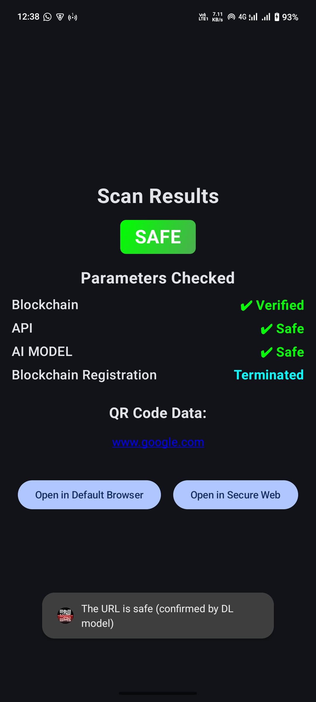
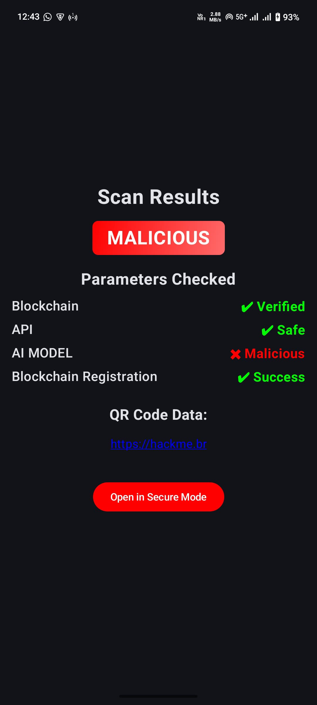
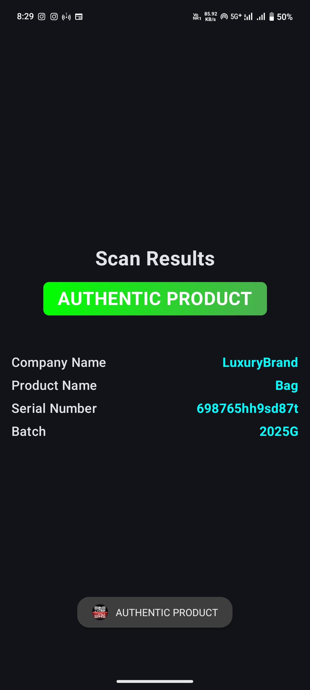

# SecureQR

## Developed Using
- **Android Studio** (Kotlin + Java)
- **MERN Stack (MongoDB, Express, React, Node js)**
- **Blockchain** (Ethereum, Solidity, Web3j)
- **IPFS**

---

## Architecture


---

## Blockchain Setup

1. **Login to Metamask Wallet**  
   - Ensure you have enough Sepolia testnet ETH.
   - Export the private key from: `Metamask -> Account Details -> Export Private Key`.

2. **Install Dependencies**  
   - Install **OpenLogic Java SDK 22**.
   - Install **Web3j CLI**.

3. **Deploy Smart Contracts**  
   - Use **Remix IDE** to deploy `QRHashRegistry.sol` and `SafeBusinessQR.sol`.
   - Copy and paste the **contract addresses**.
   - Save the **ABI and Bytecode** as `.abi` and `.bin` files respectively.

4. **Generate Java Wrapper Classes**  
   Run the following command in the terminal:
   ```sh
   web3j generate solidity -a C:\<Path_to_file>\QRHashRegistry.abi -b C:\<Path_to_file>\QRHashRegistry.bin -o C:\<Path_to_output>\Output -p com.example.secureqr.blockchain
   ```
   Move the generated `<solidity_file_name>.java` to the path:
   ```sh
   com.example.secureqr.blockchain
   ```

5. **Setup Infura for Ethereum Node Access**  
   - Create an account on [Infura](https://infura.io/).
   - Select the **Ethereum network** and configure an endpoint.
   - Copy the **Sepolia endpoint** and use it for Web3j interaction.

6. **Store Keys and Addresses**  
   - Use all obtained keys and contract addresses in `BlockchainHelper.kt`.

---

## Feature 1: Malicious QR Detection

### How It Works
1. **Extract QR Content**
   - Scanned QR code content is extracted using the **Zxing library**.
   - If it's a **URL**, it's hashed, and `checkIfHashExistOnBlockchain()` is called.
   - If the function returns `true`, the **Malicious QR Result Screen** is displayed.

2. **Redirect & Check for Malicious Activity**
   - If the hash does **not** exist on the blockchain:
     - The URL is expanded if shortened.
     - The expanded URL is sent to the **VirusTotal API**.
     - If `malicious count > 2`, the **Malicious QR Result Screen** is displayed.

3. **Deep Learning Model Analysis**
   - If VirusTotal does not detect malicious activity:
     - The URL is passed through a **CNN-BiLSTM model**.
     - If classified as **benign**, a **Safe QR Result Screen** is shown.
     - Otherwise, the **Malicious QR Result Screen** is displayed.

4. **Blockchain Integration**
   - If the URL is found malicious:
     - `addHashToBlockchain()` is called to store the hash on the blockchain.

### Malicious QR Result Screen
- Displays relevant details about the malicious QR.
- Provides a **"Open in Secure Browser"** button.
- The **Secure Browser** is a sandboxed WebView with file & content access disabled.

### VirusTotal API Integration
- `APIcheck.kt` contains:
  - `apiUrl` and `apiKey` for VirusTotal.
  - Requests are sent to VirusTotal, and the **malicious count** is extracted from the scan report.

### CNN-BiLSTM Model
- **Code available in the [CNN-BiLSTM](https://github.com/vishnu-cepian/Malicious-URL-prediction-CNN-BiLSTM-)**.
- **4-Class Model**: benign, phishing, defacement, malware.
- **Flask API Deployment**:
  ```sh
  python app.py
  ```
- Copy the **API endpoint** (`IPv4 Address:Port`) and paste it in `DL_base_URL` in `RetrofitClient.kt`.

---

## Feature 2: Product Authentication

1. **Web Dashboard (MERN)**  
   - Code available in the [SecureQR Web Dashboard](https://github.com/vishnu-cepian/manufacturer-dashboard).
   - Uses **Web3j** to interact with blockchain.
   - Manufacturers can:
     - Register their **company and products**.
     - Receive a **QR code** for their registered product.

2. **Backend Processing**  
   - Product details are **hashed** and uploaded to **IPFS**.
   - The **CID (Content Identifier)** from IPFS and the **hash** are stored on the blockchain.
   - A **QR code (CID + Hash)** is generated for the manufacturer.

3. **IPFS Integration**  
   - Login to [Pinata](https://pinata.cloud/).
   - Obtain the **API Key, API Secret, and JWT**.

4. **App Source Code Configuration**  
   - Deploy the **web dashboard backend**  ```
  cd backend
  npm run dev
  ``` and obtain the **API endpoint** (`IPv4:Port`).
   - Update `DB_BASE_URL` in `RetrofitClient.kt`.
   - Define `IPFS_BASE_URL` in `RetrofitClient.kt`.
5. **QR Verification Process**  
   - User scans the QR code.
   - Extracted **CID & hash** are compared with:
     1. Data retrieved from IPFS (**1st verification**).
     2. Data stored on blockchain (**2nd verification**).
   - If both match → **Product is authentic**, otherwise **counterfeit**.

---

## Result
<p align="center">
  
  
  
</p>


